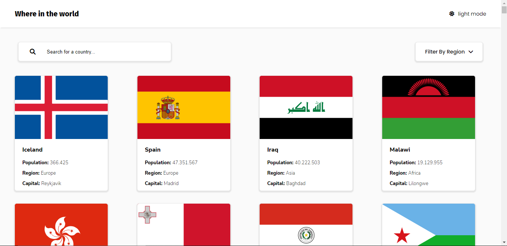
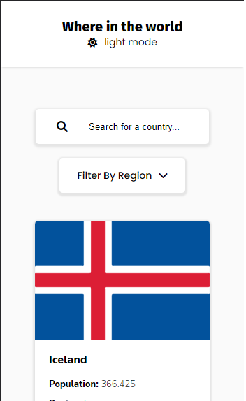

<div align="right">

[](https://rca-countries-jorgev.netlify.app/)

</div>

<div align="right">
  
  [](README.md)
  
</div>

<p align="center"> 
  
     
  <a href="https://github.com/jorge933">
    
  </a>  
     
     
  
  
</p>

<p align="center">
 <a href="#eye_speech_bubble-visualizar">Visualizar</a> •
 <a href="#information_source-sobre">Sobre</a> •
<a href="#arrow_forward-executar">Executar</a> 
 <a href="#hammer_and_wrench-tecnologias">Tecnologias</a> • 
 <a href="#brain-conceitos-aplicados">Conceitos</a> •
 <a href="#sparkles-funcionalidades">Funcionalidades</a> •
 <a href="#boy-autor">Autor</a> •
 <a href="#balance_scale-licença">Licença</a>
</p>

---

## :eye_speech_bubble: **Visualizar**

<div align="center">

Deploy do front-end efetuado no [Netlify](https://www.netlify.com/) para visualizar: [Clique Aqui](https://rca-countries-jorgev.netlify.app/)

|                             :computer:Desktop                             |                             :iphone: Mobile                              |
| :-----------------------------------------------------------------------: | :----------------------------------------------------------------------: |
| <kbd></kbd> | <kbd></kbd> |

</div>
  
---
## :information_source: _Sobre_

<div align="center">

Minha versão da aplicação proposta pelo [Frontend Mentor](https://www.frontendmentor.io/challenges/rest-countries-api-with-color-theme-switcher-5cacc469fec04111f7b848ca)

---

</div>

</div>

## :arrow_forward: **Executar**

<div align="center">

Para executar esse projeto você precisa baixar este repositório, ter o Gerenciador de Pacotes do Node ([`NPM`](https://www.npmjs.com/get-npm)) ou o Gerenciador de Pacotes YARN ([`YARN`](https://yarnpkg.com/getting-started)) instalado.

Abra o prompt de comando no diretório do projeto na pasta <code>rest-countries-api-with-color-theme-switcher</code>, e execute os seguintes códigos:

<details>
  <summary><i>com <b>npm</b></i></summary>
  
  ```bash
  # Instalar dependências
  $ npm install ou npm i
# Iniciar o servidor de desenvolvimento
$ npm start
````

</details>

<details>
<summary><i>com <b>yarn</b></i></summary>

```bash
# Instalar dependências
$ yarn install
# Iniciar o servidor de desenvolvimento
$ yarn start
````

</details>

> ⚠️ O servidor de desenvolvimento será iniciado na porta: 1234 - Acesse <http://localhost:1234>
</div>

---

## :hammer_and_wrench: _Tecnologias_

<div align="center">

| :globe_with_meridians: FrontEnd |
| :-----------------------------: |
| [HTML 5](https://www.w3schools.com/html/) |
| [CSS3](https://www.w3schools.com/css/) |
| [TypeScript](https://www.typescriptlang.org/) |
| [Parcel](https://parceljs.org/) |

</div>

---

## :brain: _Conceitos Aplicados_

<div align="center">

|      :page_facing_up:      |
| :------------------------: |
|        Media Query         |
|       Atomic Commit        |
|    Conventional Commits    |
|          Flexbox           |
|       API Consuming        |
|   Hash Location Routing    |
| Dynamic Template Rendering |
|            SPA             |
|         Dark Mode          |
|        Async Await         |
|  Destructuring Assignment  |

</div>

---

## :sparkles: _Funcionalidades_

<div align="center">

|             :page_facing_up:              |
| :---------------------------------------: |
|   Pesquisar os Paises por nome e região   |
| Acesso aos detalhes de cada um dos Paises |

</div>

---

## :boy: _Autor_

<div align="center">

<a href="https://github.com/jorge933">
 
 <br/>
 <sub><b>Jorge Vitor Pimentel</b></sub>
</a>

Desenvolvido com ❤️ por Jorge Vitor 👋🏽 Meus Contatos!

[](https://www.linkedin.com/in/jorge-vitor-7192b2210/)
[](https://github.com/jorge933)
[](mailto:jorgevitorp9@gmail.com)

</div>

---

## :balance_scale: _Licença_

<div align="center">

Copyright ©️ 2021 [Jorge Vitor Pimentel ](https://github.com/jorge933).<br />
This project is licensed by [MIT](./LICENSE).

</div>
